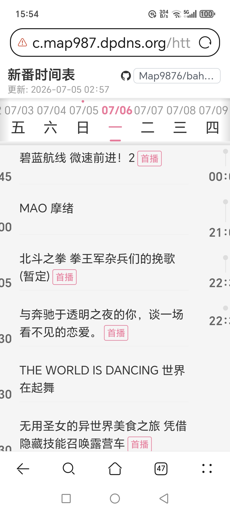
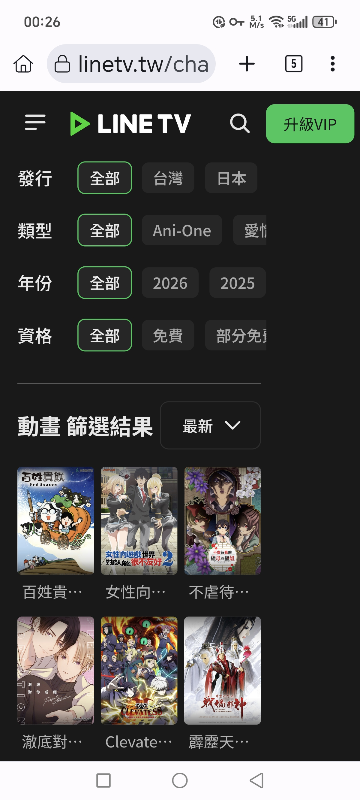
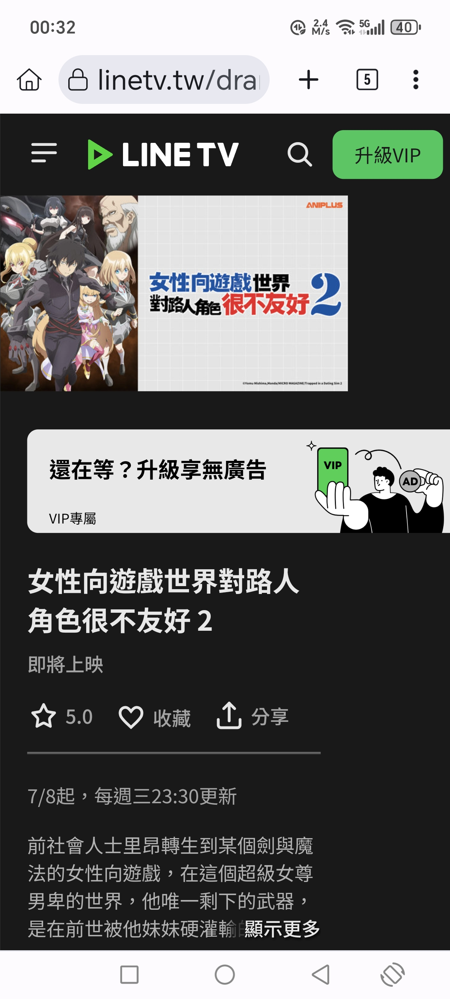
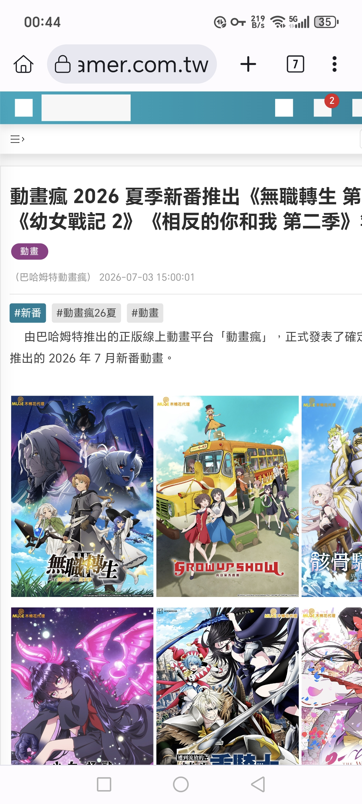

# 巴哈姆特動畫瘋 & LINE TV 新番時間表

## 数据来源

- **巴哈姆特動畫瘋** — [ani.gamer.com.tw](https://ani.gamer.com.tw/)（主页有新番周历表）
- **巴哈姆特 GNN** — [gnn.gamer.com.tw](https://gnn.gamer.com.tw/)
- **LINE TV 動畫** — [linetv.tw](https://www.linetv.tw/channel/2/genre/367)
- **季度列表页** — [ani.gamer.com.tw/seasonal.php](https://ani.gamer.com.tw/seasonal.php?c=2026_S3)（主页右下角 icon 入口）

> GNN 截图记录由 GitHub Actions 每天自动爬取，每季度只截一次。

r测试r# 巴哈姆特動畫瘋 - 新番時間表

> **以下是开发说的话：**
> "你别放tmp了" · "你把当前git workspace下的搞坏了我操" · "我让你看哔哩哔哩apk代码没让你自己写我操" · "不是我想说你到底看了源app的源码速率没有" · "非常牛逼"

**中国大陆直连 (Cloudflare Workers 代理):** https://c.map987.dpdns.org/https://map9876.github.io/baha-anime-calendar-chinese/

**GitHub Pages:** https://map9876.github.io/baha-anime-calendar-chinese/

通过 FlareSolverr 抓取巴哈姆特動畫瘋每周新番时间表，从 bgm.tv API 获取封面，
生成 Bilibili 风格的时间线页面。



本项目网页长什么样↑

---

## 数据源

### 巴哈姆特动画疯 (ani.gamer.com.tw)

- **地址:** https://ani.gamer.com.tw/
- **新番周历表:** 主页即有，显示未来 3-4 天的具体播出时间
- **季度列表页:** https://ani.gamer.com.tw/seasonal.php?c=2026_S3（入口在主页右下角 icon）
  - 季度前就开始公布新番名单
  - 季度初前后随时更新（如 7月2日公開、6月23日公開...）
  - 只有预约功能，没有番剧详情页，也没有具体时间
- **数据获取:** 需要 FlareSolverr 绕过 Cloudflare，POST 到 `https://ani.gamer.com.tw/ajax/newAnimeSnapshot.php`
- **数据量:** ~20-30 部/周（仅未来 3-4 天）


上图是

https://ani.gamer.com.tw/seasonal.php?c=2026_S3

巴哈姆特动画疯在季度前就开始公布的新番名单列表，入口在主页右下角icon就有

会在季度初前后随时更新，比如

7月2日公開

.......

6月23日公開

.......

只能预约，没有番剧详情页，也没有具体时间。


https://ani.gamer.com.tw/主页，有新番周历表。

### LINE TV (linetv.tw)

- **动画分类页（按最新排序）:** https://www.linetv.tw/channel/2/genre/367?channel_id=2&genre_token=367&page=1&sort=LAST_PUBLISH&source=DRAMA_PAGE_CATEGORY_LABEL
- **API 地址:** `https://static.linetv.tw/api/configs/schedule/scheduleList.json?t=1`
  - 静态 JSON，**直接 HTTP GET** 即可访问，无需认证，没有 Cloudflare 防护
- **数据量:** ~80-90 部/季（完整季度）
- **详情页信息:** 动画详情页有 "7/8起，每週三23:30更新" 等具体时间表
  - 该信息在 **7月2日已经能看到**（季度开始前）
  - 比巴哈姆特更早获取具体播出时间
- **数据格式:**
  ```json
  {
    "id": 12345,
    "name": "动画名称",
    "weekday": [3],
    "time": "20:00",
    "description": "7/8起，每週三20:00更新",
    "startTime": 1780272000000,
    "endTime": 1790000000000,
    "horizontalPosterUrl": "...",
    "verticalPosterUrl": "...",
    "channelName": ["動畫"],
    "total_eps": 12
  }
  ```
- **API 发现过程:**
  1. 打开 https://www.linetv.tw/channel/2/genre/191
  2. 打开开发者工具 (F12) -> Network 标签
  3. 刷新页面，过滤关键词 `scheduleList`
  4. 找到 `scheduleList.json` - 包含所有正在播出的节目
  5. 验证：无需认证，curl 可直接访问

  > 页面是 React 渲染的。时间表文本不在初始 HTML 中，由前端从 scheduleList.json 渲染。



https://www.linetv.tw/channel/2/genre/367?channel_id=2&genre_token=367&page=1&sort=LAST_PUBLISH&source=DRAMA_PAGE_CATEGORY_LABEL

linetv的 動畫 分类，按最新排序。



如上图，动画详情页有"7/8起，每週三23:30更新"

该信息在7月2日已经能看到

### 版权归属一览

巴哈姆特创作大厅每月有用户整理版权归属一览：
`https://home.gamer.com.tw/artwork.php?sn=6304834`
（2026年07月新番（夏番）版權與代理商歸屬一覽，无具体到时间的放送时间）

主題 2026年07月新番（夏番）版權與代理商歸屬一覽

无具体到时间的放送时间

### GNN 新闻 (gnn.gamer.com.tw)

- **月度时间表:** https://gnn.gamer.com.tw/detail.php?sn=307681
  - 发布日期：2026-07-03 15:00:01（每月月初几天发布）
  - 有具体播出时间
  - 入口在巴哈姆特主页
- **标签规律:** `#新番 #動畫瘋26夏`（夏天是 夏，其他季节同理）
  - `動畫瘋26秋`、`動畫瘋26冬`、`動畫瘋26春`
  - 标签聚合页: https://gnn.gamer.com.tw/search_tag.php?q=%E5%8B%95%E7%95%AB%E7%98%8B26%E5%A4%8F
- **自动化:** 每季度初定时 GitHub Actions cron 每天爬虫一次即可获取到



和


https://gnn.gamer.com.tw/detail.php?sn=307681

如上两图，7月时间表，入口也在官网主页，发布日期为 2026-07-03 15:00:01，在每个月月初前几天左右发布。有具体时间。

有 #新番 #動畫瘋26夏 tag

https://gnn.gamer.com.tw/search_tag.php?q=%E5%8B%95%E7%95%AB%E7%98%8B26%E5%A4%8F

所以按理说每季度初定时github cron每天爬虫一次也能获取到

動畫瘋26夏 换成 動畫瘋26秋

動畫瘋26冬。。

即可

### 数据源对比

| 特性 | 巴哈姆特 (ani.gamer) | LINE TV | GNN 新闻 |
|------|---------------------|---------|----------|
| 范围 | 仅未来 3-4 天 | 完整季度 | 整月 |
| 时间信息 | 仅时间 | 开播日期 + 每周时间 | 具体时间 |
| 数量 | ~20-30/周 | ~80-90/季 | 当季所有 |
| 访问方式 | 需要 FlareSolverr | 直接 HTTP GET | 直接访问 |
| 封��� | bgm.tv API | 自带海报 | 无 |
| 覆盖 | 仅本周 | 整季 | 整月 |
| 更新速度 | 季度前可预约但无时间 | 7月2日已有具体时间 | 每月月初发布 |

### 总结

- **LINE TV 更快且方便获取具体时间** — 季度初期（7月2日，甚至可能 6月底）就能看到完整时间表，无需任何防护
- **巴哈姆特动画疯番剧更全** — 巴哈姆特的番剧覆盖比 LINE TV 更完整，但获取需要 FlareSolverr
- **GNN 新闻** — 每月月初发布，有具体时间，可作为补充验证源

### 对比验证

https://youranimes.tw/animes/6142 7月2日时，没有收集到linetv已有的 "7/8起，每週三23:30更新"


总结:linetv较快(季度初期7月2日，或者6月60日前?没有看过暂时不清楚)且方便获取具体时间，但是番剧不如巴哈姆特动画疯全

### GNN 爬虫计划

在 flaresoverr 在每季度初爬取

https://gnn.gamer.com.tw/search_tag.php?q=%E5%8B%95%E7%95%AB%E7%98%8B26%E6%98%A5

#動畫瘋26春

7-1
10-1
1-1
4-1

日开爬，

自动替换

#動畫瘋26春

里的年份和季度名，注意是繁体，获取到文章就安装繁体中文字库，和emoji等等，然后网页手机版/电脑版滚动截图。最高清。

同时爬取

https://gnn.gamer.com.tw/search_tag.php?q=%E5%8B%95%E7%95%AB

也就是

#新番

的tag

在季度末6月25日，开始爬到爬取为止，和上述 #動畫瘋26春

爬做互相备用，防止tag哪个变了。

这个tag都是官方的不多，一个季度大概 40个新闻

搜尋結果：共有 577 筆資料符合 #新番

動漫

動畫瘋 2026 夏季新番推出《無職轉生 第三季》《幼女戰記 2》《相反的你和我 第二季》等作

189 人推！

2026 年夏季新番動畫《攻殼機動隊 2026》《鬥球女彈子》等作

像这种俩文章标题都有2026夏，所以每个文章去检测正文有没有 21:00 这种xx:xx的时间，作为时间表文章

### hisotry 发现过程

1. 通过 React 开发工具发现 LINE TV 的 scheduleList.json 接口
2. 通过巴哈姆特主页发现右小角 icon 进入季度列表页
3. 通过巴哈姆特主页发现 GNN 新闻的月度时间表
4. 通过标签规律发现 `動畫瘋26{季节}` 的命名模式

---

## 季度过滤

LINE TV 包含多个季度的节目。通过开播月份过滤：

```python
def get_season_range(now):
    m = now.month
    if 1 <= m <= 3:   return (1, 3)   # 冬季
    elif 4 <= m <= 6: return (4, 6)   # 春季
    elif 7 <= m <= 9: return (7, 9)   # 夏季
    else:             return (10, 12)  # 秋季
```

季度边界：
- 冬季 (1月): 1-3月（允许前一年12月）
- 春季 (4月): 4-6月（允许3月）
- 夏季 (7月): 7-9月（允许6月）
- 冬季 (10月): 10-12月（允许9月）

---

## 滑动切换实现原理

左右滑动切换日期功能参考了 B 站 Android 客户端行为的逆向实现。通过对 B 站 APK 的 DEX 字节码分析，还原了其手势处理逻辑。

### B 站 APK 源码分析

从 B 站 Android 客户端 APK (`iBiliPlayer-html5_app_bili.apk`) 中提取的关键类和方法：

| 类/方法 | 所在库 | 用途 |
|---------|--------|------|
| `HorizontalPager` | `androidx.compose.foundation.pager.Pager.kt` | 横向分页容器 |
| `PagerState.animateScrollToPage()` | `androidx.compose.foundation.pager.PagerState` | 编程式页面切换（点击 tab） |
| `SnapFlingBehavior` | `androidx.compose.foundation.gestures.snapping` | 滑动释放后的 snap 到页逻辑 |
| `AnchoredDraggableState` | `androidx.compose.foundation.gestures` | 核心手势状态机 |
| `VelocityTracker` | `androidx.compose.ui.input.pointer.util` | 速度追踪 |
| `SnapSpec` | `androidx.compose.animation.core` | 零时长动画（点击瞬时切换） |
| `HorizontalPagerControlKt` | `com.bilibili.app.comm.list.widget.pager` | B 站自定义 Pager 封装 |
| `SpringSpec(dampingRatio, stiffness)` | `androidx.compose.animation.core` | Spring 动画参数 |

### Compose 手势判定流程

```
用户触摸 → pointer down
    ↓
track deltaX, deltaY
    ↓
|deltaY| > |deltaX| ? → 纵向滚动，Compose 交给 Scrollable 处理
|deltaX| > |deltaY| ? → 横向滑动，HorizontalPager 接管
    ↓
手指抬起 → AnchoredDraggableState.settle()
    ↓
计算释放瞬间速度 (px/s)
    ↓
┌─ |velocity| >= 125 dp/s? ──→ 向速度方向翻页 (velocity priority) ──→ SnapFlingBehavior
│
└─ |velocity| < 125 dp/s? ───→ 检查位置偏移
    │
    ├─ |offset| >= 50% 页面宽? ──→ 向偏移方向翻页 (position fallback)
    │
    └─ |offset| < 50% 页面宽? ──→ snap 回原位
```

**关键设计：速度优先**

B 站（Compose）的设计是**速度优先于距离**：
- 如果释放时速度 >= 125 dp/s（约 0.375 px/ms @3x 密度），**不管拖了多少**都向速度方向翻页
- 这就是"快速滑动一点点距离也能切换"的原理
- 如果释放时速度很低（缓慢拖动），**即使拖了半屏以上**也不一定切换，还要看位置是否超过 50% 阈值
- 这就是"缓慢拖动就算整个屏幕也不会切换"的原因——速度太低触发了位置判断，但 50% 的位置阈值在慢速拖动的感知中容易被忽略

### 方向判定：为什么上下滑不会触发左右切换

Compose 的 pointer input 系统对每个手势同时追踪两个轴：

```
touchmove(deltaX, deltaY):
  if |deltaY| > |deltaX|:
     标记为纵向手势 → HorizontalPager 不消费此事件 → Scrollable 接手
  if |deltaX| > |deltaY|:
     标记为横向手势 → HorizontalPager 消费事件 → Scrollable 不触发
```

这个判定是在**每个 touchmove 事件**持续进行的。如果用户一开始横向滑动但中途转为纵向，Compose 会重新评估手势方向。`touch-action: pan-y` CSS 在网页端起到了类似的角色：告诉浏览器"垂直滚动归你，横向归 JS"。

### 速度计算方式

Compose 的 `VelocityTracker` 使用**加权平均**，权重偏向最新的采样点：

```
采样频率：每 3-5px 记录一个点
采样窗口：保留最近 ~20 个点
速度计算：最小二乘法拟合最后几个点的速度
最终速度：加权平均，最近的点权重更高
```

这种设计让**最后离屏那一刻的 flick 动作**对速度计算的影响最大——这就是为什么轻快的 flick（短暂加速）即使总移动距离很小，也能触发翻页。

### 本网页的实现

B 站用的是 Kotlin/Compose 原生手势系统。网页版只能用 Touch Events 模拟，核心逻辑对照：

```
touchstart → record startX, startY, transition = 'none'（无延迟跟手）
touchmove  → 计算 deltaX, deltaY
  ├─ |deltaY| > |deltaX| × 1.5 → 纵向滚动，放弃 swipe（类比 Compose 的方向判定）
  └─ |deltaX| > |deltaY| → 横向滑动
     └─ translate track 跟随手指（类比 Compose 的 drag 阶段）
touchend  → 计算速度（最后 3 个采样点）
  ├─ |velocity| > 0.08 px/ms → 向速度方向切换（velocity priority）
  ├─ |delta| > 10% 屏幕宽 → 向偏移方向切换（position fallback）
  └─ 否则 snap 回原位
```

### 动画参数

| 场景 | B 站 (Compose) | 本网页 |
|------|---------------|--------|
| 点击 tab 切换 | `SnapSpec`（零时长，瞬时） | `transition: none`（瞬时） |
| 手指滑动跟手 | Compose 内置 drag | `transition: none` + transform translate |
| 滑动释放归位 | `SnapFlingBehavior(SpringSpec)` | `0.35s cubic-bezier(.25, .46, .45, .94)` |
| 点击日期栏滚动 | `animateScrollToPage(spring)` | `bar.scrollTo(behavior:'smooth')` |

### 防止浏览器拦截手势

B 站 Android 客户端是原生应用，不存在浏览器手势拦截问题。网页版需要额外处理：

1. **`touch-action: pan-y`** — CSS 属性，告诉浏览器"只处理垂直方向的默认手势，水平方向留给 JS"
2. **两侧填充内容** — `.timeline-track` 用 flex 布局，左右相邻日期都有实际内容，浏览器检测到可滚动内容后不会触发"左右滑动切换页面"的默认行为
3. **`overscroll-behavior: none`** — 防止浏览器边缘的"下拉刷新"或"右滑返回"

### 方向锁定（2026-07-05 修复）

**问题：** 上下滑动内容时，手指轻微水平偏移会导致误判为横向滑动，页面跳转到其他日期。

**原因：** 原实现每次 `touchmove` 都重新计算 `deltaX/deltaY`，垂直滚动中若有微小水平偏移（常见），放弃判断可能失效。

**B 站 Compose 的处理方式：**
Compose 的 gesture system 在**第一次判定方向后即锁定**，不再重新评估：

```
touchmove 第一次偏移 > 阈值:
  ├ |deltaY| > |deltaX| → 锁定为垂直 → 交给 Scrollable，不再处理
  └ |deltaX| > |deltaY| → 锁定为水平 → HorizontalPager consume
```

**网页版修复：** 改为相同的方向锁定逻辑：

```javascript
// 方向未锁定且移动 < 10px → 等待
// 方向未锁定且移动 > 10px:
//   |deltaY| > |deltaX| → 释放给浏览器原生滚动, isActive=false
//   |deltaX| > |deltaY| → 锁定为水平, preventDefault, 跟手
// 方向锁定后 → 不再重新判断
```

部分动画有特殊的首周播出安排：
- "7/4首週播出2集，EP1 19:00 EP2 19:30，7/12起，每週日23:00後更新"
- "7/2首週播出3集，7/9起，每週四22:00後更新"

详细解析逻辑见 `fetch_linetv.py` 中的 `parse_description()` 函数。

---

## 去重逻辑

LINE TV 和巴哈姆特的数据通过模糊标题匹配去重：
1. 标准化标题（去除空格、括号、季节标记）
2. 计算相似度评分
3. 评分 >= 0.85 视为匹配，跳过 LINE TV 条目

---

## 数据流

```
fetch.py (FlareSolverr) -> schedule.json (巴哈姆特, 本周)
fetch_linetv.py (HTTP GET) -> linetv_schedule.json (LINE TV, 整季)
                                        |
build.py -> 合并两个数据源 -> 去重 -> 生成 index.html
```

---

## 未来计划

### 电影过滤

当前每周重复逻辑会把所有 LINE TV 条目都按周重复显示。但电影（一次性播出）不应该重复。

计划方案：
- 通过 Wikipedia / anidb / bgm.tv / kansou.me 等获取季度番剧表
- 与 LINE TV + 巴哈姆特数据求交集
- 识别出非周播条目（电影、OVA、SP等），标记为一次性
- 方式：AI 正则提取 或 第三方 API 交叉验证
- **LINE TV API 自带海报链接**（horizontalPosterUrl / verticalPosterUrl），可用于封面显示，无需额外抓取

### 封面 / 图片托管

当前通过 bgm.tv API 获取封面，速度慢且不稳定。

计划方案：
- 通过 bgm.tv 下载封面图片
- 上传到 EdgeOne CDN 或仓库内托管
- 每次仓库更新自动同步
- 封面链接换为 EdgeOne CDN 链接
- LINE TV API 自带 horizontal/vertical 海报链接，可优先使用

---

## 本地构建

```bash
# 安装依赖
pip install requests zhconv

# 获取巴哈姆特数据
python3 fetch.py

# 获取 LINE TV 数据
python3 fetch_linetv.py

# 构建 HTML
python3 build.py

# 输出文件: index.html
```
